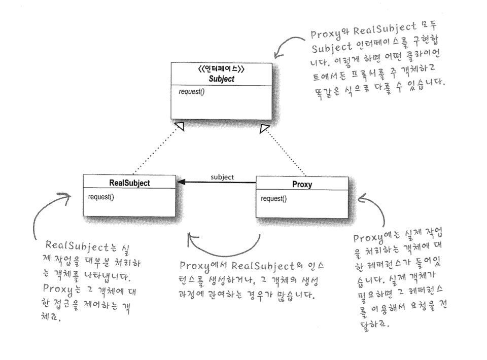

# Proxy Pattern


코딩을 시작하기 전에 요구사항을 정확하게 파악해야한다... 이건 만고의 진실-

프록시는 진짜 객체를 대신하는 역할을 맡게 된다. 원격 프록시는 원격 객체에 대한 로컨 대변자 역할을 하게 된다.


 Java에서 사용하고 있는 RMI가 위와 같은 원격 Proxy역할을 하게 되는 듯?

```java
MyExpectation.java

interface Consumer{
  void consume(Object some);
}

// 이런 구조를 이루고 있지 않을까 흐음.
class ProxyClass implements Comsumer{
  
  Cosumer realclass;
  
  @override
  void consume(Object some){
    realclass.comsume(some);
  }
  
}

class RealClass implements Comsumer{
  @override
  void consume(Object some){
    print("some");
  }
}

```

RMI -> 이 친구는 꼭알아야하는 것인가 흠.. 이거 정말 옛날 소켓통신 방법인거 같은데 말이여. 흐으믐


```java
public interface MyRemote extends Remote{
  public String sayHello() throws RemoteException;
}

public class MyRemoteImpl extends UnicastRemoteObject implements MyRemote{
  
  public String sayHello(){
    return "hello!";
  }
  
  public MyRemoteImpl() throws RemoteException{
    
  }
  
  public static void main(){
    try{
      MyRemote remote = new MyremoteImpl();
      Naming.rebind("remoteHello", remote);
    }catch(Exception ex){
      ex.print();
    }
  }
  
}


```


### ProxyPattern

> 어떤 객체에 대한 접근을 제어하기 위한 용도로 대리인이나 대변인에 해당하는 객체를 제공하는 패턴.


결국 대변인이 가장 중요한 개념이다. 특정 기능을 실행시키는데 실제 객체를 사용하지 않고 그 대변인 객체를 이용해서 기능을 사용할 수 있도록 하는 패턴이다.

원격 프록시, 가상 프록시, 보호 프록시가 존재한다.

* 원격프록시 : 원격객체에 대한 접근을 제어한다.
* 가상 프록시 : 생성하기 힘든 자원에 대한 접근을 제어한다.
* 보호 프록시 : 접근 권한이 필요한 자원에 대한 접근을 제어 할 수 있습니다.

즉 가장 큰 의의는 **접근하기 힘든** 객체에 대한 접근을 제어하는 것.



가상 프록시의 경우 지연생성을 하는데 쓰이게 되는 패턴이다...!

가상 프록시는 또한 지연 로딩도 가능하게 한다. 일단 PlaceHolder를 가지고 있는 Proxy를 만든 후에 그 Proxy가 RealSubject를 호출하고 RealSubject가 모든 일을 끝마치고 나면 set해주는 식으로 처리할 수 있다.


### 객체지향  원칙

* 바뀌는 부분은 캡슐화 한다.
* 상속 보다는 구성을 사용한다.
* 구현이 아닌 인터페이스에 맞춰서 프로그래밍한다.
* 서로 상호작용을 하는 객체 사이에서는 가능하면 느슨하게 결합하는 디자인을 사용해야 한다.
* 클래스는 확장에 대해서는 열려 있지만 변경에 대해서는 닫혀 있어야한다.
* 추상화된 것에 의존하라. 구상 클래스에 의존하지 않아야 한다.
* 친한 친구들과만 연락한다.
* 먼저 연락하지 마세요 저희가 연락 드리겠습니다.
* 어떤 클래스가 바뀌게 되는 이유는 한가지 뿐이여야 한다.

### 프록시 패턴

> ​	다른 객체를 대변하는 객체를 만들어서 주 객체에 대한 접근을 제어 할 수 있습니다.