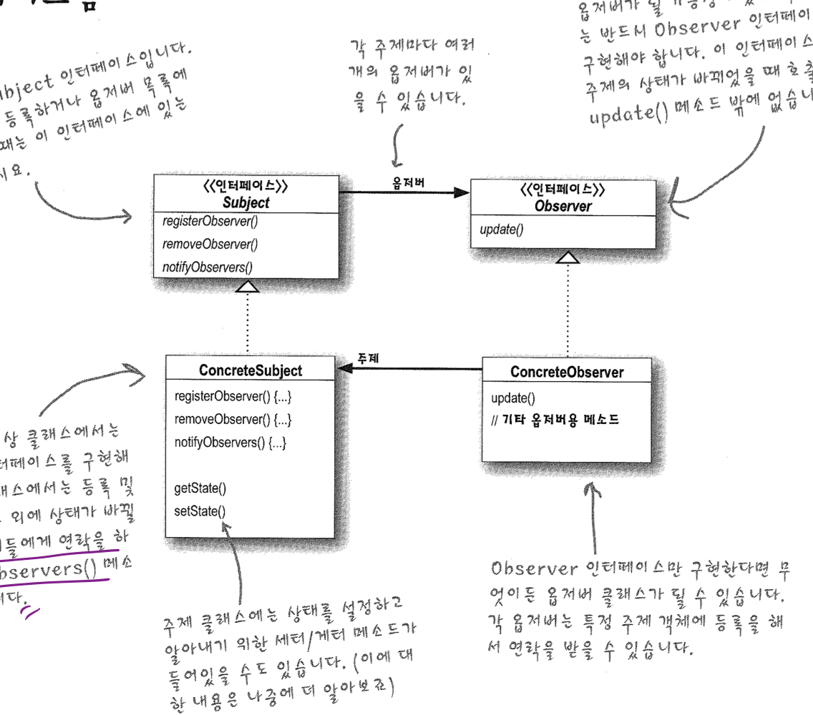

# Observer

## Observer Pattern

##### 한 객체의 상태가 바뀌면 그 객체에 의존하는 다른 객체들한테 연락이 가고 자동으로 내용이 갱신되는 방식으로 일대다 의존성을 정의하고 있는 패턴.

 -> Subject객체가 여러 Observer들은 관리하고 자신의 상태가 변경되었을 때 현재 subscribe중인 Observere들에게 자신의 변경사항에 대해서 notify하는 패턴이라고 할 수 있다. 

```java
interface Subject{
  void notifyAll();
  void subscribe(Observer observer);
  void unsubscribe(Observer observer);
}

interface Observer {
	void update();
}


```

> 요즘들어서 계속 사용하고 있는 Reactive Programming (Rx) 의 경우는 Observer Pattern과 Functional Programming을 복합적으로 사용하고 있는 실 예제라고 볼 수 있지 않을까?



---

## 느슨한 결합의 위력

 두 객체가 느슨하게 결합되어 있다는 것은, **그 둘이 상호작용을 하지만 서로에 대해 잘 모르고 겉으로 드러난 부분만 알고 있다는 것을 의미**한다. 여기서 겉으로 들어난 부분이란 interface라고 할 수 있다. 특히, Observer 패턴에서는 느슨하게 결합된 객체 디자인을 제공하게 되는데 위에 있는 이미지를 살펴보면 확인 할 수 있다. Subject의 경우 Observer를 구현한 어떤 객체던지 subscribe, unsubscribe, notify가 가능하기 때문에 Observer interface를 구현한 새로운 클래스를 생성해도 Subject의 코드를 수정하는 동작이 필요하지 않다. 또한 만약 Subject를 구현한 객체에 어떤 기능이 추가되어야 된다고 생각해 보자, 그 때 우리는 Subject에서 overriding된 메소드를 그대로 두고 새로운 method를 추가 or 앞에서 사용한 composition을 사용하여 새로운 기능을 추가할 수 있다.


## 디자인 원칙 

> ##### 서로 상호작용을 하는 객체 사이에서는 가능하면 느슨하게 결합하는 디자인을 사용해야한다.

느슨하게 결합하는 디자인을 사용하면 변경사항이 생겨도 무난히 처리할 수 있는 유연한 객체지향 시스템을 구축할 수 있다. 객체 사이의 **상호의존성을 최소화** 할 수 있기 때문이다. 여기서 말하는 상호의존성의 최소화는 최소한의 method만 구현하면 된다는 것에서 비롯되는것 아닐까?!


#### 브레인 파워 -> Subject에서 Observer로 notify할 때 value가 늘어나거나 줄거나 하면서 매번 바뀌게 된다면???

이 경우 Data 클래스를 사용하면 좋을 것 같다. Data클래스의 구조는 key-value가 있는 Map구조로 사용하고 LinkedList HashMap과 같은 구조로 하면 좋을 것 같다. 더해서, item이 충돌 할때 Strategy를 overwriting or merging으로 하여서 그냥 HashMap or LinkedList HashMap을 사용하면 좋은 Data 클래스로 쓰일 수 있을 것 같다.

```java

interface Observer{
  void notfy(Data data);
}

class Data{
  Map map;
  void setValue(String key, T value);
  void getValue(String key);
  ConflictStrategy strategy;
}

enum ConflictStrategy {
  MERGE, OVERWRITING
}
```


### Java's Observable and Observer

Java에서 Observer 패턴을 구현한 Observerable과 Observer는 약간의 차이가 있다. 첫번째로 Java의 Observable에서 setChanged()를 통하여 **언제** Observerble에게 notify할 건지를 조절 할 수 있다. 이러한 유연성을 토대로 우리가 원하는 때에 Observer들에게 notify()가 가능하다.

---

### 디자인 도구 상자

* #### 객체지향 원칙

  * 바뀌는 부분은 캡슐화한다
  * 상속보다는 구성을 사용한다.
  * 구현이 아닌 인터페이스에 맞춰서 프로그래밍한다.
  * 서로 상호작용을 하는 객체 사이에서는 가능하면 느슨하게 결합하는 디자인을 사용해야 한다.

* #### 옵저버 패턴

  * 한 객체의 상태가 바뀌면 그 객체에 의존하는 다른 객체들한테 연락이 가고 자동으로 내용이 갱신되는 방식으로 일대다(one to many) 의존성을 정의한다.