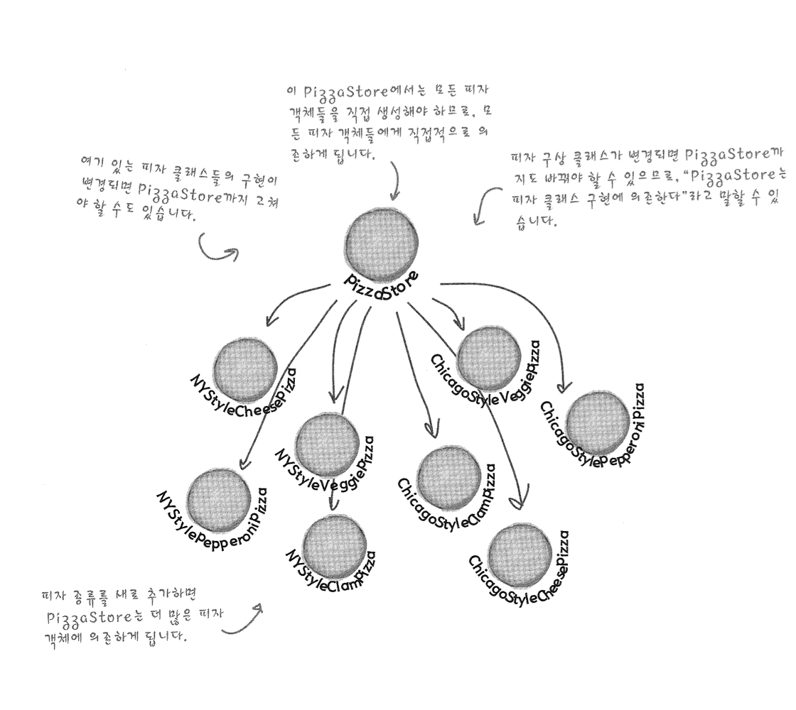

# Factory Pattern

### OCP

>  확장에 대해서는 열려있고 변화에 대해서는 닫혀있는 원리-

### Simple Factory Pattern

> 객체를 생성하는 부분만을 분리하여서 객체한테 객체를 생성하는 책임을 주는 패턴이다.

엄밀히 말하면 팩토리패턴은 디자인패턴이 아니지만 많은 사람들이 팩토리 패턴을 사용하고 있으므로 *준*패턴정도로 한다.

---

## Factory Method Pattern

> 팩토리 메소드 패턴에서는 객체를 생성하기 위한 인터페이스를 정의하는데, 어떤 클래스의 인스턴스를 만들지는 서브클래스에서 결정하게 만듭니다. 팩토리 메소드 패턴을 이용하면 클래스의 인스턴스를 만드는 일을 서브클래스한테 맡기는 것이다.

즉 Factory Method Pattern은 객체의 생성에 대한 책임을 서브클래스에게 위임하여서 그 책임을 수행하게 만든다. 이를 사용하면 루징한 결합을 완성할 수 있게 된다. 또한 이 후에 말하겠지만 이를 통하여 제어의 역전이 이뤄진다. 어떤 구현을 생성을 할지는 서브클래스에 정한다는 것이 가장 중요한 점이다.

### Dependency Inversion Principle

> 추상화된 것에 의존하도록 만들어라. 구상 클래스에 의존하도록 만들지 않도록 한다.

요번 챕터에서 가장 헷갈렷던 개념이다. 이 개념에 대해서 명확히 이해하기 위해서는 PizzaStore가 여러가지 구상클래스인 NY_Pizza들을 생각하면 된다. 

 위 다이어그램에서 보면 PizzaStore가 모든 피자에 대해서 import 및 compose한다는 것을 알 수 있다. 여기서 Dependency Inversion을 적용하게 되면

이런식으로 다이어그램이 나오게되는데 PizzaStore는 오직 Pizza라는 추상화된 녀석만 알게 되고 나머지 Concrete class들도 Pizza라는 구상 클래스만 알고 있는것이 중요하다. 아까의 다이어그램과 다르게 화살표 방향이 아래에서 위쪽으로 가는 식으로 바뀌었는데 이걸 보면 Dependency Inversion Principle이 어떻게 이루어졌는지 알 수 있다!!

##### DIP를 이루기 위해서 할 수 있는 것들?

* 어떤 변수에도 Concreate Class에 대한 레퍼런스를 저장하지 않는다.
* 구상 클래스에서 유도된 클래스를 만들지 않는다.
* 베이스 클래스에 이미 구현되어 있던 메소드를 오버라이드하지 않는다.

-> 하지만 원칙적으로 이런 것을 모두 할 수 는 없다..! 우리가 알아야하는 것은 이런 것들을 **추구**해야한다는 점이다.

---

## Abstarct Factory Pattern

> 추상팩토리 패턴에서는 인터페이스를 이용하여 서로 연관된, 또는 의존하는 객체를 구상 클래스를 지정하지 않고도 생성할 수 있습니다.

어떤한 제품군을 만들 때 쓸 수 있는 패턴이라고 볼수 있다. 추상적인 인터페이스를 사용하여 제품군을 제작하는 것은 Abstract Factory를 구현한 Concrete Factory가 제작하도록 한다.

### Abstarct Factory Pattern VS Factory Method Pattern

FMP의 경우 class를 사용하여 제품을 만들고 AFP의 경우 instance를 사용하여 제품을 만든다고 볼 수 있다. FMP의 경우 상속을 사용하여 객체를 생성하고 AFP의 경우 구성을 사용하여 만든다. ~~구성을 사용해서 만든다는 것은 ??? 뭐지 멀까~~

 -> 이 부분의 경우 친구가 설명해 준 것처럼 Pizza라는 객체가 IngredientFactory를 **가지고** 있으면서 그에 대한 생성 책임을 미루는 것을 봤을 때 여기서 **구성**을 사용한다고 볼 수 있다.

---

### 디자인 도구 상자

* #### 객체지향 원칙

  * 바뀌는 부분은 캡슐화한다
  * 상속보다는 구성을 사용한다.
  * 구현이 아닌 인터페이스에 맞춰서 프로그래밍한다.
  * 서로 상호작용을 하는 객체 사이에서는 가능하면 느슨하게 결합하는 디자인을 사용해야 한다.
  * 클래스는 확장에 대해서는 열려있지만 변경에 대해서는 닫혀있어야 한다.
  * 추상화된 것에 의존하라. 구상 클래스에 의존하지 않아야 한다. 

* #### 추상화 팩토리패턴 

  * 서로 연관된 또는 의존적인 객체들로 이루어진 제품군을 생성하기 위한 인터페이스를 제공합니다. 구상 클래스는 서브클래스에 의해 만들어진다.

* #### 팩토리 메소드 패턴

  * 객체를 생성하기 위한 인터페이스를 만듭니다. 어떤 클래스의 인스턴스를 만들지는 서브클래스에서 결정하도록 합니다. 팩토리 메소드를 이용하면 인스턴스를 만드는 일을 서브클래스로 미룰 수 있습니다.