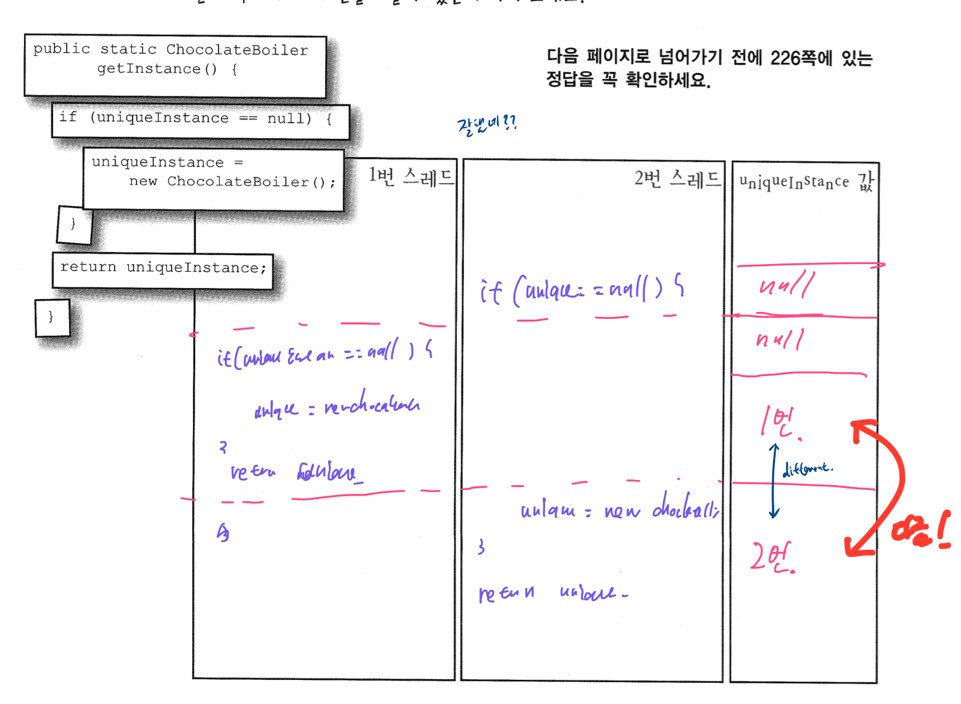

# Singleton


싱글톤 패턴은 객체를 단 한개만 생성하는 것을 목표로 하고 그 외에도 지연생성, 멀티 쓰레드 환경에서의 유일성 등을 갖추고 있어야 한다.


## Singleton Pattern

> 싱글톤 패턴은 해당 클래스의 *인스턴스*가 하나만 만들어지고, **어디서**든지 그 인스턴스에 접근할 수 있도록 하기 위한 패턴입니다.  

일반적으로 쓰이는 싱글톤 패턴의 경우 multi thread 환경에서 문제가 생길 수 있기 때문에 DCL을 사용하여 구현하게 된다.


#### 일반적으로 구현되는 싱글톤 

```java

Class Singleton {
	private static Singleton sInstance; 
	
	private Singleton(){}
	
	public Singleton getInstance() {
		if(sInstance == null) {
			sInstance = new Singleton();
		}
		return sInstance;
	}
}

```


##### 위 코드로 발생할 수 있는 문제점 



> synchronzied 를 이용해서 개선한다면??

```java

Class Singleton {
	private static Singleton sInstance; 
	
	private Singleton(){}
	
	public syncronized Singleton getInstance() {
		if(sInstance == null) {
			sInstance = new Singleton();
		}
		return sInstance;
	}
}
```

 이 코드의 문제점 매번 접근 할때마다 syncronized에 의한 오버헤드가 발생한다는 것이다...! 그렇기 떄문에 다음의 Solution이 나오게 된다.


#### DCL(Double-Checking Locking) 을 이용한 싱글톤 구현

> 이 경우 Double Cheking을 이용하여 맨 처음 getInstance() 에서 instance가 null 일때만 synchronized() 로 접근하기 때문에 그에 대한 오버헤드가 크지 않게 된다. 

```java

Class Singleton {
	private static Singleton sInstance;

	private Singleton(){}

	public Singleton getInstance(){
		if(sInstance == null) {
			synchronzied(Singleton.class){
				if(sInstance == null) {
					sInstance = new Singleton();
				}
			}	
		}
		return sInstance;
	}
}
```


### Class Loader

> part of the [**Java Runtime Environment**](https://www.geeksforgeeks.org/differences-jdk-jre-jvm/) that dynamically loads Java classes into the JVM

JVM에 Class 파일들을 로드하는 녀석으로서 JRE를 구성하고 있는 녀석이다. Class Loader가 하는 주요한 일은 클래스를 memory로 동적으로 로드하는 것이다.  3가지 타입으로 구성된 자바 클래스로더가 존재하고 이에 대한 자세한 내용은 [**classloader-in-java**](https://www.geeksforgeeks.org/classloader-in-java/)에서 볼 수 있다. 


### NameSpace

> **네임스페이스**(Namespace)는 개체 또는 모듈을 구분할 수 있는 범위를 나타내는 말로 일반적으로 하나의 이름 공간에서는 하나의 이름이 단 하나의 개체만을 가리키게 된다.

즉 여기서 말했던 NameSpace의 경우 Java에서 패키지 관리를 통하여 java.lang.util.* 혹은 javax.swing.sql.* 이런식으로 이 안에서 같은 클래스 명이 들어가도 서로가 구별되기 위하여 관리되는 범위를 나타낸다고 볼 수 있다.