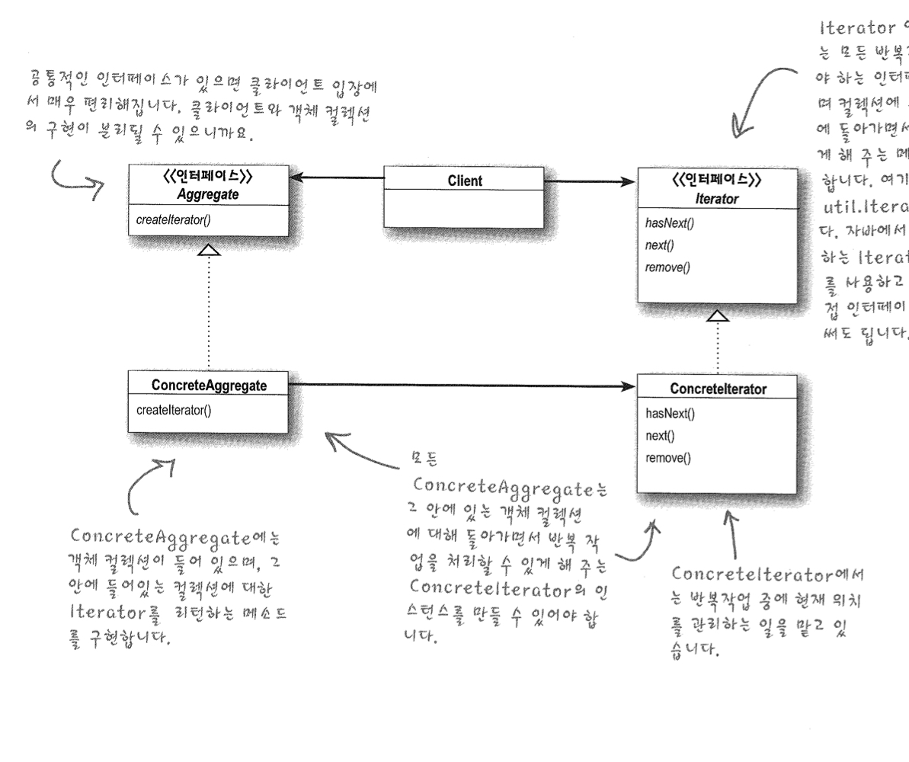
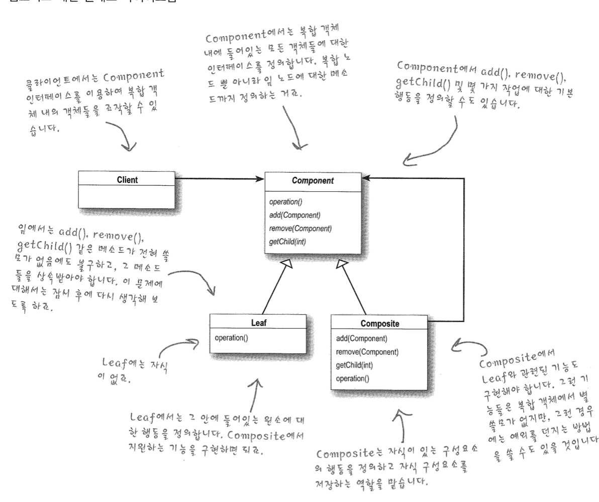

# Iterator and Compiste


### Iterator Pattern

> 반복을 캡슐화 한다? 반복 할 수 있는 collection들을 캡슐화시킨다.

```java
public interface Iterator{
  boolean hasNext();
  Object next();
} // 굳이 여기서 generic을 쓰지 않을 이유가 있을까..

public interface Iterator<T>{ // generic을 사용해서 어떤 객체에 대한 Iterator인지 표시할 수 있다.
  boolean hasNext();
  T next();
}
```


연습문제  -> 직접 구현해본 Iterator

```java
class PancakeHouseIterator implements Iterator {
  
  List<MenuItem> menuitems;
  int position = 0;
  
  public PancakeHouseIterator(List<MenuItem> list){
    menuItems = lits;
  }
  
  public boolean hasNext(){
    if(menuitems.indexOf(position + 1)!= -1){
      return true;
    }
    return false;
  }
  
  public MenuItem next(){
    	return menuItems.get(position++);
  }
  
}
```


만약 우리가 interface에 맞춰서 프로그래밍한다는 원칙을 지키기 위해서는 MenuItem이라는  iterface를 만들 필요가 생기게 된다.

 ```java
interface MenuItem{
  createIterator();
}
 ```


### Iterator Pattern

> 이터레이터 패턴은 컬렉션 구현 방법을 노출 시키지 않으면서도 그 집합체 안에 들어있는 모든 항목에 접근할 수 있게 해주는 방법을 제공해줍니다.

즉 이 패턴을 이용하면 컬렉션이 어떻게 구현되어 있는지 신경쓰지 않고 각 컬렉션의 항목에 접근 할 수 있다. 장점으로는 컬렉션과 이터레이터가 각자 할 것만 신경쓰면 되게 된다. 즉 컬렉션은 자기가 원래 구현하고자 한 특징만 구형하면 간단하고 반복에 대한 책임은 이터레이터한테 넘겨주게 되면 된다. 하지만 순서의 경우 우리가 가정하지 않는 것이 좋은거 같다.




### 단일 역할 규칙 (Single Responsibie Priciple)

> 클래스를 바꾸는 이유는 한 가지 뿐이어야한다.

만약에 클래스에서 원래 그 클래스의 역활(집합체 관리) 외에 다른 역할(반복자 메소드)을 처리하게 되도록 하면, **두가지** 이유로 그 클래스가 달라질 수 있다. 이럴때 우리가 쓸수 있는 원칙은 SRP인데 이 SRP는 단일 객체는 단일 책임을 갖고 있어야 한다는 원칙이다. 그런 이유로서 SRP는 우리가 클래스를 변경하는데 있어서 명확한 규칙을 제시해준다. 우리가 주의 깊게 코드를 살피지 않으면 2가지 이상의 역할을 하게 되는 클래스를 만드는 것이 매우 쉽게 발생하게 된다.


### 응집도(cohesion)

> 한 클래스 또는 모듈이 특정 목적 또는 역할을 얼마나 일관되게 지원하는지를 나타내는 척도

응집도가 높다는 것은 서로 연관된 기능이 모여있다는 뜻이다. 우리가 서로 연관된 클래스들을 나눌때 package마다 응집도가 높게 나누게 되는 이유 이기도 하다.


<u>Framework == 우리가 필요로하는 여러가지 interface랑 class를 포함하고 있다고 생각하면 된다.</u>


### Composite Pattern

> 컴포지트 패턴을 이용하면 객체들을 트리 구조로 구성하여 부분과 전체를 나타내는 계층구조로 만들 수 있습니다. 이 패턴을 이용하면 클라이언트에서 개별 객체와 다른 객체들로 구성된 복합 객체(composite)를 똑같은 방법으로 다룰 수 있습니다. 

즉, 내가 생각하는 느낌으로는 File과 Folder가 같은 상위형식을 구현해서 같은 취급을 받게 하는 패턴이 아닐까 싶다.

```java
abstract class Componenet { // 굳이 근데 전부 UnSupoortedException을 던져야되나???
  abstract public void print();
  public void addComponent(Component component);
  public void removeComponent(Component component);
  public List<Component> getCompoents();
}

class Leaf extends Component{
  @override
  public void print(){
    print("imnode");
  }
}

class Node extends Component{
  
  List<Component> components;
  
  public void addComponent(Component component){
    components.add(component);
  }
  
  public void removeComponent(Component component){
    components.remove(component);
  }
  
  public List<Component> getCompoents(){
    return components;
  }
  
}


```

그냥 Class diagram 보는게 제일 속편하다고 볼 수 있다.



즉 여기서 보는 것처럼 클라이언트는 Component를 leaf와 node모두를 포함한 개념이라고 생각하고 BFS/DFS등을 사용해서 처리만 한다면 생각보다 쉽게 traveling과 subDirectory문제가 풀린다는 것을 알 수 있다... 즉 이 패턴이 가장 잘 쓰이는 곳은 File System이 아닐까 싶다...! 

이 패턴은 구조적인 패턴이고  음... 전체 - 부분을 표현할 때 가장 중요한 패턴인거 같다. 여기서 말하는 전체 - 부분이란 FileSystem에서  Folder - File로 정의되는 전체와 부분의 차이라고 할 수 있다.

하지만 이 패턴을 사용함으로서 SRP원칙에 위배된다. 대신에 투명성을 사용해서 요번에는 instanceOf를 사용하지 않고 처리 할 수 있다는 장점이 있다. 단점으로는 부적절한 method가 호출 될 수 있다는 점이다.


```java

// Composite Pattern && Iterator Patter을 활용
class CompositeIterator implements Iterator {

    Stack<Iterator> stack = new Stack();

    CompositeIterator(Iterator iterator) {
        stack.push(iterator);
    }

    @Override
    public void remove() {
        throw new UnsupportedOperationException();
    }

    @Override
    public boolean hasNext() {
        return false;
    }

    @Override
    public Object next() {
        if (hasNext()) {
            Iterator iterator = stack.peek();
            MenuComponent menuComponent = iterator.next();
            if (compoenent instanceof Menu) {
                stack.push(menuComponent.createIterator());
            }
            return menuComponent;
        } else {
            return null;
        }
    }
}
```

지금 이 composite들을 탐색(travel)할때는 전위탐색이 사용되었고 여기서 사용한 알고리즘은 DFS로 파악된다. 생각보다 재귀호출을 많이 사용하고 있어서 코드를 보는 것이 쉽지 않을거라는 생각이 들었다. 여기에 더해서 Caching까지 더한다면 Dynamic Programming을 구현한다고 할 수 있겠다.


### 객체지향 원칙

* 바뀌는 부분은 캡슐화 한다.
* 상속보다는 구성을 활용한다.
* 구현이 아닌 인터페이스에 맞춰서 프로그래밍한다.
* 서로 상호작용을 하는 객체 사이에서는 가능하면 느슨하게 결합하는 디자인을 사용해야 한다.
* 클래스는 확장에 대해서는 열려있지만 변경에 대해서는 닫혀 있어야 한다.
* 추상화된 것에 의존하라. 구상클래스에 의존하지 않도록 한다.
* 친한 친구들하고만 이야기한다.
* 먼저 연락하지 마세요. 저희가 연락드리겠습니다.
* 어떤 클래스가 바뀌게 되는 이유는 한가지 뿐이여야 한다.


### 이터레인터 패턴

> ​	컬렉션을 표현하는 방법을 노출 시키지 않으면서도 집합체 내에 있는 모든 객체들에 하나씩 접근하는 방법을 제공합니다.


### 컴포지트 패턴

> ​	객체들을 트리 구조로 구성하여 부분-전체 계층 구조로 구현합니다. 컴포지트 패턴을 이용하면 클라이언트에서 개별 객체와 복합 객체를 똑같은 방법으로 다루도록 할 수 있습니다.


